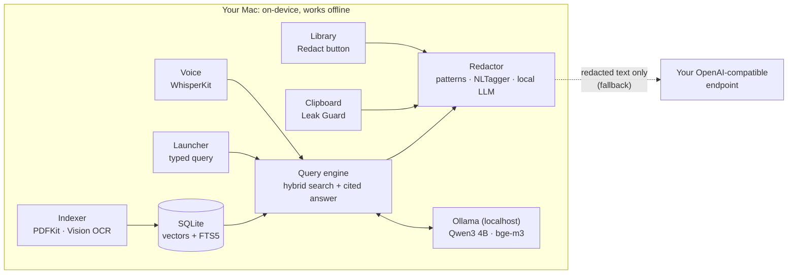

# Gel

**A private AI layer for your Mac.** Ask your own files questions out loud in Taglish, get answers with highlighted citations, and keep personal data out of cloud AI. All of the core AI runs on the Mac and works with Wi-Fi off.

Built for the **AppBuildersPH Hackathon 2026** (theme: Local AI), October 9–10, 2026.

<!-- TODO before submitting: fill in every "TBD" below. -->

| | |
| --- | --- |
| **Project name** | Gel |
| **Short description** | A native macOS app that answers questions about your files with on-device AI, cites the exact page, redacts Philippine personal data, and stops it from being pasted into ChatGPT. |
| **Team** | 12M (registered as "abububwebwe") · Joshua Gem Vicente ([@joshuagemvicente](https://github.com/joshuagemvicente)), solo <!-- TODO: match the names on appbuildersph.com/hackathon --> |
| **Demo video (~1 min)** | TBD |
| **X / LinkedIn post** | TBD (tags Devin / Cognition, includes #AppBuildersPH) |
| **Platform** | macOS 15+, Apple Silicon |
| **Status** | In development during the hackathon. See [Features](#features) for what's built. |

---

## Why does Gel benefit from running AI locally?

HR files and personal documents contain government ID numbers (SSS, TIN, PhilHealth, Pag-IBIG, PhilSys), salaries, bank accounts and home addresses. The Data Privacy Act of 2012 (RA 10173) protects all of them. Sending them to a cloud AI is exactly the risk companies and individuals need to avoid, so for Gel local AI is a requirement, not a preference.

Gel needs local AI for four reasons:

- **Private.** Speech-to-text, OCR, search and the LLM all run on the Mac, so sensitive files never leave it.
- **Works offline.** Gel stays useful when the cloud disappears. The whole core demo runs with Wi-Fi off.
- **Cheap enough to run on every copy.** Leak Guard checks every clipboard change. Doing that through a cloud API would cost money per copy, and it would mean sending your clipboard to a third party.
- **Fast.** Hold-to-talk questions need answers in seconds, with no round trip to a server.

Gel can fall back to a cloud model when the local LLM fails, but that model only ever receives **redacted** text (see [Cloud fallback](#cloud-fallback-secondary-redacted-only)).

---

## The problem and who it's for

HR staff paste employee records into ChatGPT to summarize and shortlist applicants. Individuals paste IDs and bank statements. Spotlight finds files but can't answer questions or cite a scanned page, and nothing stops the paste.

- **B2B first: HR, recruiting and payroll teams** at Philippine SMEs and BPOs. They handle 201 files, resumes, payslips and government IDs. The Data Privacy Act also requires them to appoint a Data Protection Officer (DPO).
- **B2C: anyone** who keeps IDs, bank statements or medical records on their Mac.

A single engine serves both audiences through **packs**, which are configuration files, not code. The hackathon build ships the full HR pack and a lighter Personal pack.

---

## How Gel maps to the judging criteria

| Criterion | Weight | How Gel addresses it |
| --- | --- | --- |
| Problem & Usefulness | 25% | A clear first user, HR teams, with a legal reason to need it (Data Privacy Act, DPO reports). Packs extend the same engine to consumers. |
| Local AI Implementation | 25% | Speech-to-text, embeddings, retrieval, LLM answers, OCR and personal-data detection all run on-device. The cloud is a secondary, redacted-only fallback. |
| Technical Execution | 20% | One demo flow rehearsed with Wi-Fi off, a tested fallback when Ollama is stopped, and unit tests on the redactor. |
| Innovation | 15% | Gel sits between people and cloud AI. It catches personal data at the clipboard before it reaches ChatGPT, and pastes a redacted copy instead. |
| Product & Demo Quality | 15% | A native top-center launcher (⌥Space) plus a warm, minimal main window, demonstrated live. |

---

## Demo story (5-minute pitch)

All demo files are synthetic. No real personal data appears anywhere.

1. **Offline voice query.** Turn Wi-Fi off. Press ⌥Space, hold right ⌥, and ask: *"Sino sa applicants ang may 5+ years sa payroll?"* ("Which applicants have 5+ years in payroll?") A streamed answer appears with citation chips and a **Local** badge.
2. **Verify the citation.** Click a chip. The main window opens at the exact page of a *scanned* resume, with the passage highlighted.
3. **Redact.** Select the resumes in the Library and click **Redact**. A preview lists every finding, then Gel writes PDFs with black boxes burned into the page.
4. **Catch a leak.** Turn Wi-Fi back on, copy an employee record and switch to ChatGPT. An overlay shows *"This would leak 3 government ID numbers, 1 salary, 1 address"*, and ⌥⌘V pastes the redacted version instead. One click exports the DPO report, which contains counts only.
5. **Consumer reveal (20 s).** Switch to the Personal pack, copy passport and bank-statement text, and Leak Guard catches both with no other setup.
6. **Optional: the fallback stays safe.** Stop Ollama and ask again. The answer arrives with a **Cloud** badge, and "What was sent" shows only placeholders such as `[SSS_1]` and `[NAME_2]`.

---

## Features

Status markers are updated as features land.

| # | Feature | What it does | Status |
| --- | --- | --- | --- |
| F1 | Indexing | Indexes a folder you pick: PDFs (PDFKit text, or Vision OCR for scanned pages), images, and DOCX. Chunks keep their page and position so citations can be highlighted. `bge-m3` embeddings plus SQLite FTS5 keyword search. | ⏳ |
| F2 | Voice input | Hold right ⌥ to talk. WhisperKit transcribes Taglish on-device. The transcript stays editable, and typing always works. | ⏳ |
| F3 | Cited answers | Hybrid search, then a local LLM answer with numbered citations. If the files don't contain the answer, it replies *"Hindi ko nakita sa files"* ("I didn't find it in the files") instead of guessing. | ⏳ |
| F4 | Detection and redaction | Three layers: Philippine ID, phone and ₱ patterns; Apple `NLTagger` for names and places; a local LLM pass for addresses and salary context. Redacted PDFs are rasterized so the original text can't be recovered. | ⏳ |
| F5 | Leak Guard and safe paste | Watches the clipboard and the frontmost app (browsers, ChatGPT, Claude). It warns before a leak, and ⌥⌘V pastes redacted text. Clipboard contents are never stored. | ⏳ |
| F7 | Packs | JSON packs define which data types to catch. HR (full) and Personal (light) ship with the app. Adding a pack needs no code change. | ⏳ |
| F8 | Team policy and DPO report | An admin `policy.json` locks settings ("Managed by your organization") and sets each data type to warn or block. The DPO report exports counts and categories, never content. | ⏳ |

F6 (acting on the Finder selection) was cut from the start. The Library's Redact button replaces it.

**App surfaces**

- **Launcher:** opens with ⌥Space at top center, where Spotlight and Raycast appear. You type or talk there and get a short answer with citation chips and a Local or Cloud badge.
- **Main window:** a sidebar with Home (privacy stats), History, Library with the document viewer, Redactions & Leak Guard, and Settings.

**Choosing the local answer model**

- **Settings → Models** lists every LLM already installed in Ollama, read from Ollama's `/api/tags` endpoint.
- Pick one and it becomes the model for answers and the AI detection pass. Qwen3 4B is the default.
- The choice takes effect on the next question, with no restart. The answer badge shows which model replied, e.g. **Local · qwen3:4b**.
- If the chosen model is removed from Ollama, Gel switches back to the default and says so.
- The search model stays fixed on `bge-m3`. Every indexed passage is stored as `bge-m3` vectors, so changing it would mean re-indexing the whole folder.
- If an admin `policy.json` pins a model, the picker is locked and shows "Managed by your organization".

---

## Architecture



The only way data leaves the Mac is through the redactor.

| Layer | Technology |
| --- | --- |
| App shell | Swift, SwiftUI, AppKit `NSPanel` (launcher and overlay) |
| Speech-to-text | WhisperKit, Whisper `large-v3-turbo` |
| LLM | Ollama, Qwen3 4B by default (any installed Ollama model can be chosen in Settings), through Ollama's OpenAI-compatible `/v1` API |
| Embeddings | Ollama `bge-m3`, fixed (multilingual, handles Taglish) |
| OCR and PDF | Apple Vision, PDFKit |
| Name and place detection | Apple NaturalLanguage (`NLTagger`) |
| Storage | SQLite: vectors stored as blobs, FTS5 for keyword search |
| Hotkeys and paste | KeyboardShortcuts, `CGEvent` |
| Secrets | macOS Keychain (cloud API key only) |

---

## What runs locally vs what needs internet

| Function | Runs locally | Needs internet |
| --- | --- | --- |
| Speech-to-text | ✅ WhisperKit | No |
| OCR | ✅ Apple Vision | No |
| Search embeddings | ✅ Ollama `bge-m3` | No |
| Answer generation | ✅ Ollama Qwen3 4B | Only as a fallback, sending redacted text to your OpenAI-compatible endpoint |
| Personal-data detection | ✅ Patterns, `NLTagger`, local LLM | Only as a fallback for the LLM pass, on text the first two layers already redacted |
| Redaction, Leak Guard, safe paste | ✅ | No |
| DPO report, policy | ✅ | No |
| First-time model downloads | — | Yes, once during setup |

---

## Cloud fallback (secondary, redacted only)

Gel always uses the local model first. Gel has one OpenAI-compatible client with two base URLs: Ollama at `http://localhost:11434/v1`, and an endpoint you supply.

- **Off by default.** It can only be turned on in Settings → Cloud fallback, once a base URL is set. The API key is stored in the macOS Keychain, never in files or logs.
- **When it triggers:**
  - Ollama is unreachable or returns a 5xx error.
  - The model is missing.
  - The first token takes more than 8 s, or the whole answer more than 30 s.
  - The response is empty or malformed.

  After a failure Gel retries local after 60 s.
- **Redaction gate, a hard rule:**
  - The full prompt is redacted before any cloud request, with placeholders such as `[NAME_1]` and `[SSS_1]`.
  - The mapping from placeholder to real value stays in memory on the Mac.
  - If the redactor fails, **no request is sent**.
- **Embeddings, speech-to-text and OCR never fall back.**
- **Visible.** Every answer carries a **Local** or **Cloud** badge, and "What was sent" shows the exact redacted payload.

---

## Setup for judges

Gel isn't deployed as a hosted app. These steps rebuild it from this repository.

### Requirements

- A Mac with Apple Silicon (M1 or newer), running macOS 15 or later. 16 GB RAM is recommended.
- About 8 GB of free disk space for the models and the index.
- Xcode 26 or later.
- [Homebrew](https://brew.sh).

### 1. Install the local models

```bash
brew install ollama xcodegen
brew services start ollama
ollama pull qwen3:4b
ollama pull bge-m3
```

<!-- TODO: if the build switches to a different Qwen3 tag (e.g. the non-thinking instruct build), update the pull command and the disclosures. -->

The WhisperKit speech model (about 1.6 GB) downloads the first time you use voice.

### 2. Generate the synthetic demo files (optional)

```bash
python3 -m venv scripts/.venv
scripts/.venv/bin/pip install -r scripts/requirements.txt
scripts/.venv/bin/python scripts/generate_demo_data.py
```

This writes fictional HR documents, scans and personal documents to `demo-data/`.

### 3. Build and run

```bash
cd Gel
xcodegen generate
open Gel.xcodeproj   # select the "Gel" scheme, then Run
```

The project is signed to run locally, so it doesn't need a paid Apple Developer account.

### 4. First launch

1. Choose who it's for, Work (HR) or Personal, and pick the folder to index. For the demo, use `demo-data/HR Files`.
2. Grant the permissions macOS asks for:
   - **Microphone**, for voice.
   - **Accessibility**, for the hotkey and safe paste.
3. Press **⌥Space** and ask a question.

### 5. Optional: a different local answer model

Pull any chat model with Ollama, for example `ollama pull llama3.2:3b`. Then select it in Settings → Models. Gel has only been tested with Qwen3 4B, the default.

### 6. Optional: cloud fallback

In Settings → Cloud fallback, enter a base URL (e.g. `https://<host>/v1`), an API key and a model name. Click **Test connection**, then turn it on. Without these settings, Gel stays local-only.

---

## Measured performance

The briefing rules out fake benchmarks, so this table lists only numbers measured on the demo machine (Apple M2, 16 GB). Anything not yet measured says so.

| Measurement | Result |
| --- | --- |
| Indexing 50 synthetic documents (10 scans) | Not yet measured |
| Voice: release key to transcript (10-word Taglish query) | Not yet measured |
| Question to first answer token (local) | Not yet measured |
| Redacting a 5-page scan | Not yet measured |
| Leak overlay after switching to ChatGPT | Not yet measured |

---

## Disclosures

- **Models:** Qwen3 4B (Alibaba, via Ollama; the default local answer model, which users can swap for any model installed in Ollama), BGE-M3 (BAAI, via Ollama), Whisper large-v3-turbo (OpenAI weights, run with WhisperKit). The cloud fallback model is whichever one the user configures. The demo uses a Claude model through an OpenAI-compatible endpoint.
- **Technologies and frameworks:**
  - App: Swift, SwiftUI, AppKit, PDFKit, Vision, NaturalLanguage, SQLite (FTS5).
  - Libraries: [WhisperKit](https://github.com/argmaxinc/WhisperKit), [KeyboardShortcuts](https://github.com/sindresorhus/KeyboardShortcuts).
  - Runtime and build tools: [Ollama](https://ollama.com), [XcodeGen](https://github.com/yonaskolb/XcodeGen).
  - Demo data generator: Python with reportlab, python-docx and Pillow.
- **APIs and cloud services:** an optional OpenAI-compatible endpoint, used only as the redacted fallback. Nothing else is called at runtime.
- **Existing code and assets:** no code from before the hackathon. The project began on October 9, 2026. The open-source libraries above are used as dependencies. All demo documents are synthetic and generated by `scripts/generate_demo_data.py`.
- **AI development tools:** Claude Code (Anthropic). Devin was not used.

---

## Limits and next steps

**Hackathon scope:** one Mac, one folder, one user. Out of scope for now:

- Windows and AMD builds.
- Multi-user sync.
- App Store sandboxing.
- Legal compliance certification.

**After the hackathon:**

- More packs: Finance/KYC and Legal.
- Policy deployment through MDM.
- Embedding the model runtime so Ollama isn't required.
- A notarized download and a Homebrew cask.

**Business model (pitch only, not built):**

- **B2B:** per-seat team plans with policy control and DPO reports.
- **B2C:** a free Personal app.

---

## Submission checklist

- [ ] Project name and short description
- [ ] Team members match the official AppBuildersPH list
- [ ] Repository is public before 10:00 AM, October 10 (code freezes then)
- [ ] Demo video, about 1 minute
- [ ] X or LinkedIn video post tagging Devin / Cognition, with #AppBuildersPH
- [ ] What runs locally and what needs internet (above)
- [ ] Disclosures: models, frameworks, APIs, existing code, AI tools (above)
- [ ] The "why local" answer (above)
- [ ] Submitted once at [cerebralvalley.ai/e/appbuildersph-hackathon-2026](https://cerebralvalley.ai/e/appbuildersph-hackathon-2026)
